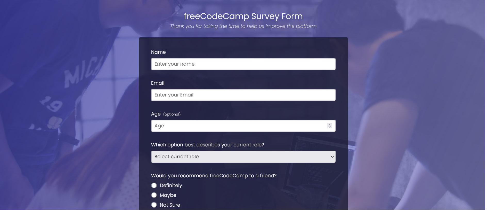

# fCC Responsive Design - Survey Form

This is a solution to the [freeCodeCamp responsive design survey form](https://www.freecodecamp.org/learn/2022/responsive-web-design/).

## Overview

### The challenge

Build a survey form with HTML and CSS

### Screenshot

### Links
- Live Site URL: [fCC responsive design survey form](https://survey-form.freecodecamp.rocks/)

## My process

### Built with

- Semantic HTML5 markup
- CSS custom properties
- Flexbox

### What I learned

It was the first time that i made a survey form. ordering the html tags and making css was a good challenge

## Acknowledgments

Thanks a lot to freeCodeCamp for these challenges

